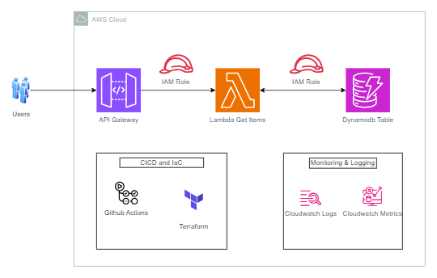
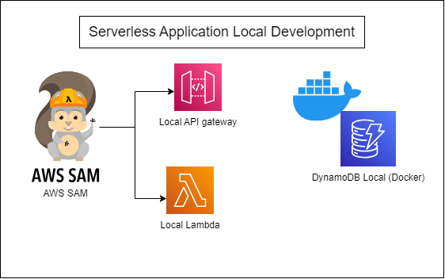
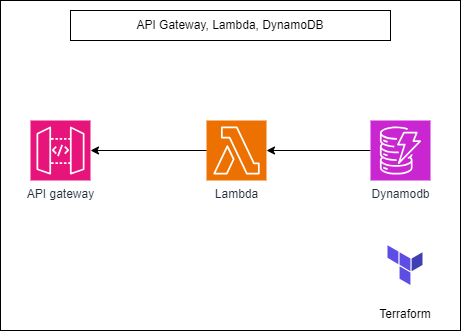

# Cloud Resume API Challenge
This repo contains IaC both SAM and Terraform to provision and set up the cloud resume API challenge both on your local machine and on AWS respoectively.



A link to the case study and architecture: https://medium.com/@aesheriff30/cloud-resume-api-challenge-aws-phase-1-architecting-and-planning-5957ad21617e

## Running on Local



In `/lambda-local` folder contains SAM template and lambda code and also docker-compose to spin up a dynamodb container. A very detailed guide is given: https://medium.com/@aesheriff30/cloud-resume-api-challenge-aws-phase-2-local-development-for-serverless-applications-e3277004700c

But on a high level to spin it up, navigate to the directory (Ensure you have docker ans SAM cli installed)

```
cd lambda-local
```

spin up dynamodb using docker compose

```
docker-compose up
```

Build SAM template

```
sam build
```

Start the SAM local API

```
sam local start-api --docker-network lambda-local_serverless 
```

## Running on AWS



To spin up the infra on AWS, ensure you have your AWS credentials (Access Keys and Secret Access Key) configured on your machine. A detailed guide is given: https://medium.com/@aesheriff30/cloud-resume-api-challenge-aws-phase-3-moving-to-the-cloud-cecbd649b90f

But on a high level to spin it up, execute the commands (Ensure you have terraform installed)

Navigate to the terraform directory

```
cd terraform-infra
```

Initialize terraform

```
terraform init
```

Validate the terraform config
```
terraform validate
```

Apply the configuration

```
terraform apply --auto-approve
```

# Accessing the API

Ensure you access the api on the invoke url route /resume-data


